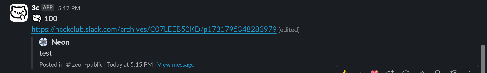

## 3c board

React to a message with :3c: and it will post the url of the message in a channel!!
You may find the bot within the hackclub slack.

## Setup
1. Clone the repo
2. Run `yarn install`
3. Create a `.env` file with the following variables